<div align="center">
  


  <a href="#welcome"><kbd> <br> Welcome! <br> </kbd></a>&ensp;&ensp;
  <a href="#system-overview"><kbd> <br> System overview <br> </kbd></a>&ensp;&ensp;
  <a href="#final-look"><kbd> <br> Final look <br> </kbd></a>&ensp;&ensp;
  <a href="#how-to-install"><kbd> <br> How to install? <br> </kbd></a>&ensp;&ensp;
  <a href="#what-will-change"><kbd> <br> What will change? <br> </kbd></a>&ensp;&ensp;
  <a href="#keybinds"><kbd> <br> Keybinds <br> </kbd></a>&ensp;&ensp;
  <a href="#packages"><kbd> <br> Packages <br> </kbd></a>
</div>
<br>


<a id="welcome"></a>

# 👋 Welcome!

Hi! This is my first rice, so if you find any errors or need help, feel free to [create an issue](https://github.com/MrE8065/MyDotfiles/issues) and i will try to help :).

> [!TIP]
> Check my little CLI tool to manage dotfiles, [copydots](https://github.com/MrE8065/copydots). I use it here!

<br>

<a id="system-overview"></a>

# 🔍 System overview

<br>
<div align="center">

|         Distro          |                                            [Arch](https://archlinux.org)                                                      |
| :---------------------: | :---------------------------------------------------------------------------------------------------------------------------: |
|          WM             |                                            [Hyprland](https://hypr.land)                                                      |
|        Terminal         |                                       [Kitty](https://github.com/kovidgoyal/kitty)                                            |
|          Bar            |                                     [Waybar](https://github.com/Alexays/Waybar)                                               |
|         Shell           |                             [Zsh](https://www.zsh.org) with [Oh My Zsh](https://ohmyz.sh)                                     |
|      Shell Prompt       |                                           [Starship](https://starship.rs)                                                     |
|      App launcher       |                                        [Wofi](https://hg.sr.ht/~scoopta/wofi)                                                 |
|      File manager       |                                  [Thunar](https://docs.xfce.org/xfce/thunar/start)                                            |
|        Editor           |                                     [Neovim](https://github.com/neovim/neovim)                                                |
|       Editor 2          |                                     [VSCode](https://code.visualstudio.com/)                                                  |
|        Browser          |                                           [Firefox](https://firefox.com)                                                      |
|       Power menu        |                                   [wlogout](https://github.com/ArtsyMacaw/wlogout)                                            |
|   Notification Center   |                             [Swaync](https://github.com/ErikReider/SwayNotificationCenter)                                    |
|       Lockscreen        |                                   [Hyprlock](https://github.com/hyprwm/hyprlock)                                              |
|     Display Manager     |                                        [SDDM](https://github.com/sddm/sddm)                                                   |
|   Wallpaper switcher    |               [Waypaper](https://github.com/anufrievroman/waypaper) with [swww](https://github.com/LGFae/swww)                |
|      Music player       |                           [Spotify](https://www.spotify.com) with [spicetify](https://spicetify.app)                          |
|    Screenshot tool      |                                    [Hyprshot](https://github.com/Gustash/Hyprshot)                                            |
|      Image viewer       |                                       [qview](https://interversehq.com/qview/)                                                |
|       GTK theme         |                                [Materia dark](https://github.com/nana-4/materia-theme)                                        |
|      Cursor theme       |                                   [Bibata](https://github.com/ful1e5/Bibata_Cursor)                                           |
|      Icons theme        |                         [Papirus](https://github.com/PapirusDevelopmentTeam/papirus-icon-theme)                               |
|         Fonts           |   [Noto Fonts](https://fonts.google.com/noto) and [JetBrainsMono from Nerd Fonts](https://www.nerdfonts.com/font-downloads)   |

</div>
<br>


<a id="final-look"></a>

# 👀 Final look

Here you can see how the system will look after the customization. Cool, right?

<div align="center">
  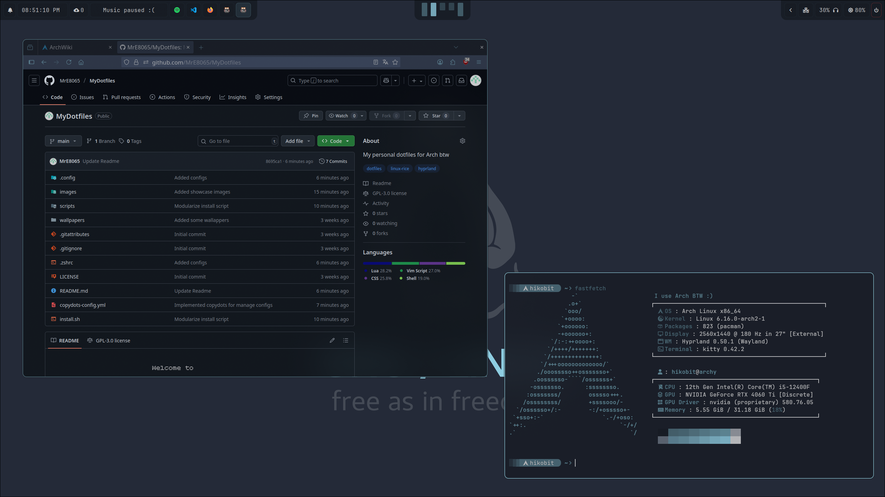
  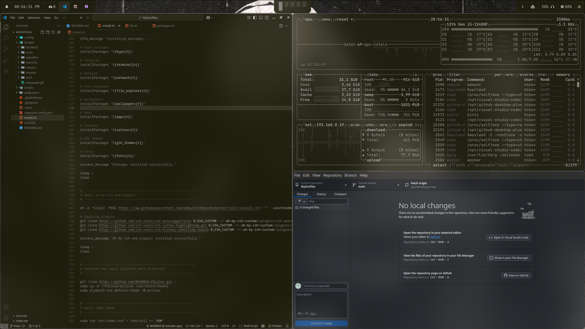
  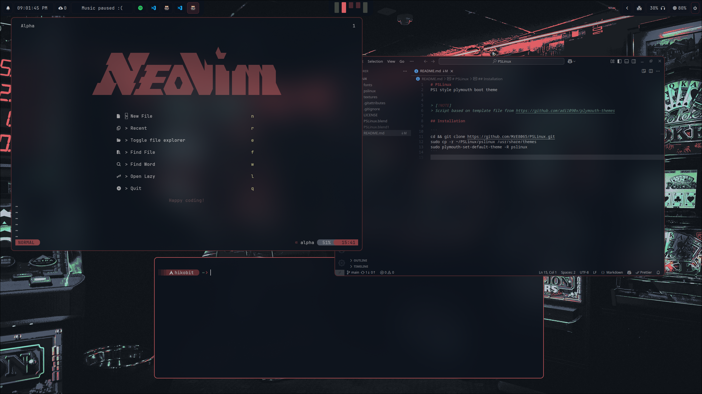
  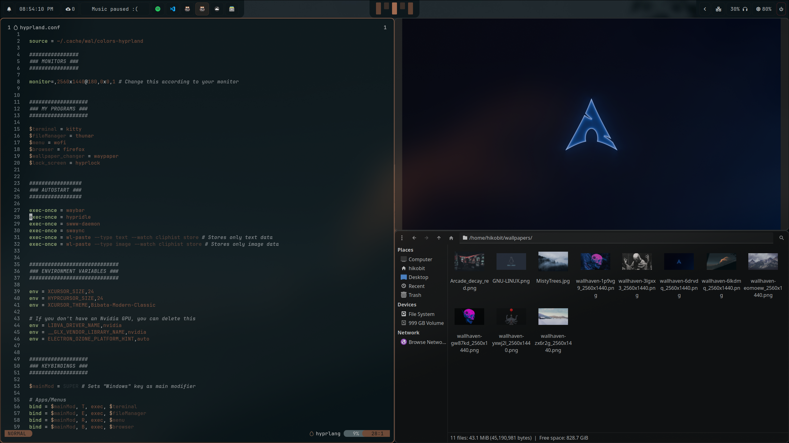
</div>


<a id="how-to-install"></a>

<br>

# 🛠️ How to install?

> [!IMPORTANT]
> The installation script is designed for a minimal Hyrpland [Arch Linux](https://wiki.archlinux.org/title/Arch_Linux) installation, but **may** work on other distros.

> [!WARNING]
> I asume that you already have the `git` package installed. If not, what are you waiting for?

I recommend to take a look at the [Packages](./scripts/packages.sh) script to see all the packages that will be installed. In case you don't want something, go and modify it.
That been said, to install, simply execute this commands:

```
  git clone https://github.com/MrE8065/MyDotfiles.git ~
  cd ~/MyDotfiles
  chmod +x install.sh
  ./install.sh
```


<a id="what-will-change"></a>

<br>

# ❓ What will change?

<br>

<details>

  <summary>Waybar</summary>
  
  ## Overview
  Minimal, clean and efficient. It includes all the features that I think are important to have in a bar.

  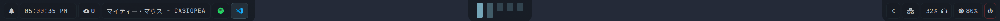
  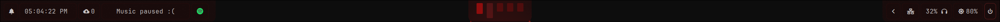
  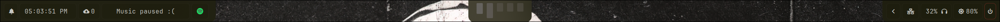


  ### Notifications
  It will open the [swaync panel](#swaync).


  ### Time
  If you hover, it will display a simple calendar with the current date. Right click to see next month and left click to see the previous one.


  ### Updates
  It will show any available updates for the packages installed thanks to the ``checkupdates-with-aur`` package.


  ### Music player
  Shows the current playing track name and artist. Central click to pause/resume, left to previous track and right click for next one. Hover to show the player name.
  It only appears when a supported player is active.


  ### Taskbar
  Just the ``taskbar`` module from waybar.


  ### Workspaces
  5 simple bars that grow if they are selected or if there's apps opend in them.

  <div align="center">
    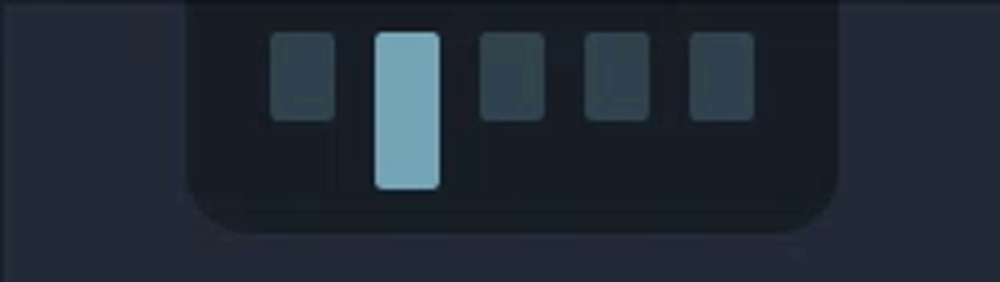
  </div>


  ### Expanding Group
  Button to hide/reveal certain widgets you don’t need all the time. In here you can find:
  
  - **Tray**: Default ``tray`` module from waybar.

  - **Hyprpicker Widget**: Lets you use `hyprpicker`, display values when hovered, and copy the hex value to your clipboard. It also changes color!

  
  ### Network
  Shows the connetion type (wifi/ethernet), if you hover shows the network name. Click to open ``nm-connection-editor``.


  ### Sound
  Shows the volume percentage and device icon. Scroll to change volume and click to open ``pavucontrol``.


  ### Brightness
  Shows the current brightness of the screen and allows to modify it scrolling up or down. Thanks to ``ddcutils``, you can control even external monitors!


  ### Power menu
  Opens the [wlogout menu](#wlogout)

</details>

<br>

<details>
  <summary>Wofi</summary>

  ## Overview
  Simple apps menu with a search bar. It also shows apps options (triangle to the left).
  
  <div align="center">
    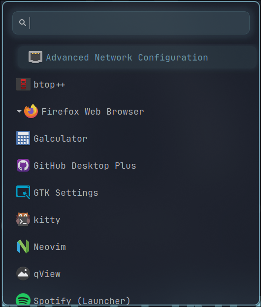
    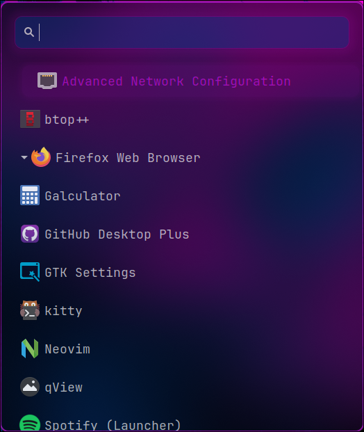
    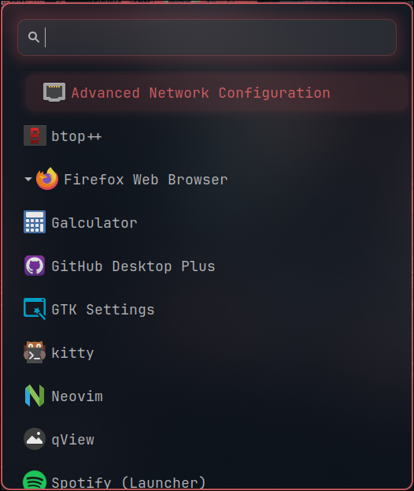
  </div>

</details>

<br>

<details id="swaync">
  <summary>Swaync</summary>

  ## Overview
  Notification center with clear button and *Do not disturb* mode.

  <div align="center">
    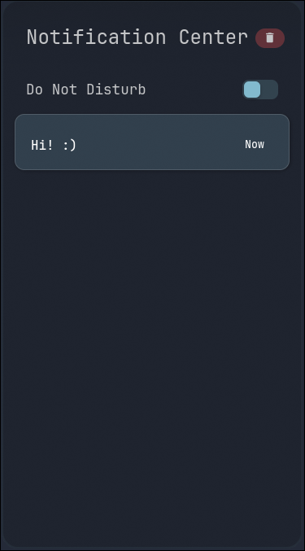
    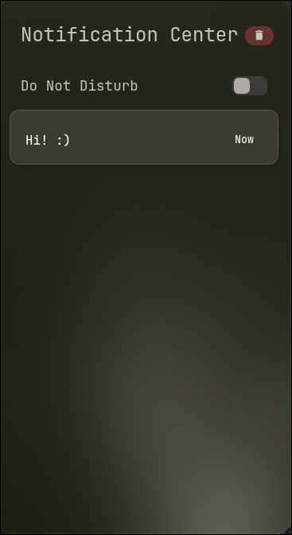
    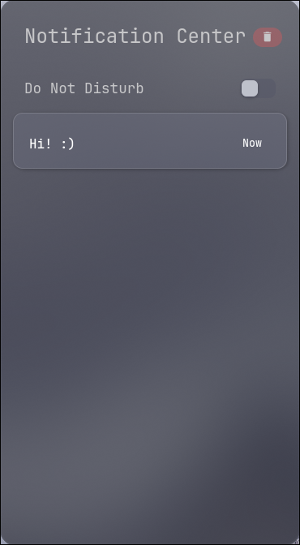
  </div>

</details>

<br>

<details>
  <summary>Hyprlock</summary>
  
  ## Overview
  Lockscreen. Uses the current wallpaper from Pywal to generate the background and colors, displays a greeting with your username.

  <div align="center">
    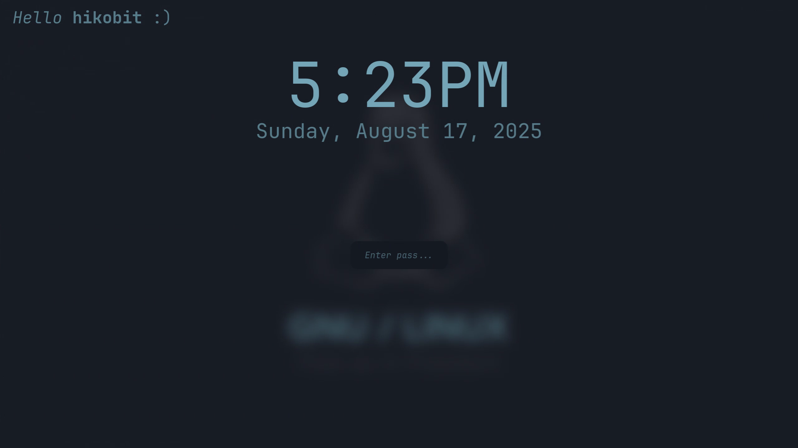
    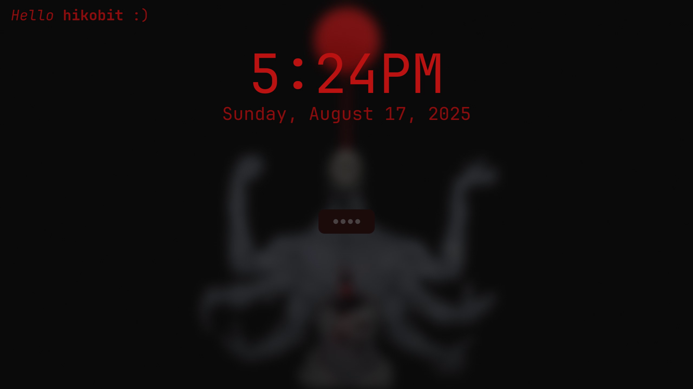
    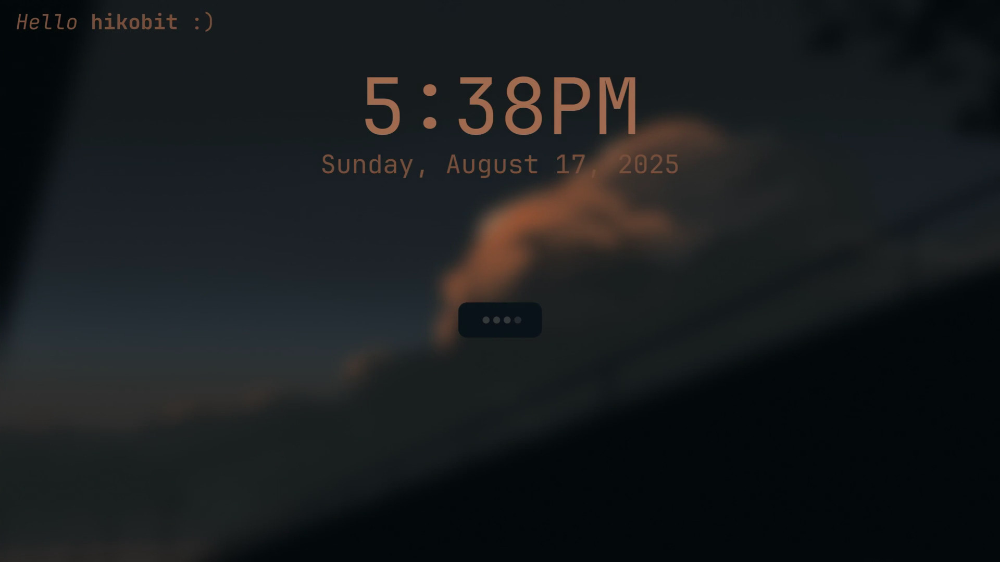
  </div>

</details>

<br>

<details>
  <summary>Nvim</summary>
  
## Overview
Uses Lazyvim to create a simple, useful and functional IDE. Colorscheme follows pywal generated colors! Features the following plugins:
  - alpha-nvim
  - nvim-autopairs
  - noice.nvim
  - lushwal.nvim
  - nvim-colorizer.lua
  - gitsigns.nvim
  - mini.icons
  - lualine.nvim
  - markview.nvim
  - nvim-cmp
  - nvim-tree.lua
  - snacks.nvim
  - telescope.nvim
  - nvim-treesitter
  - which-key.nvim

<div align="center">
  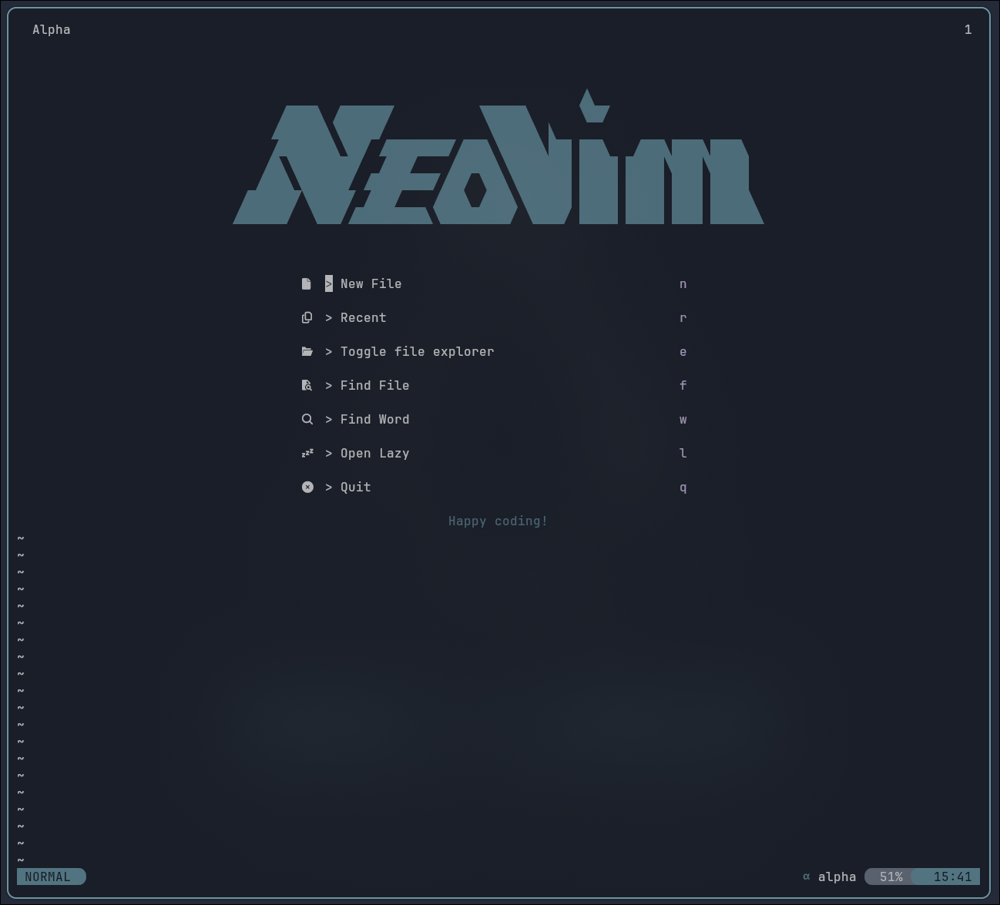
  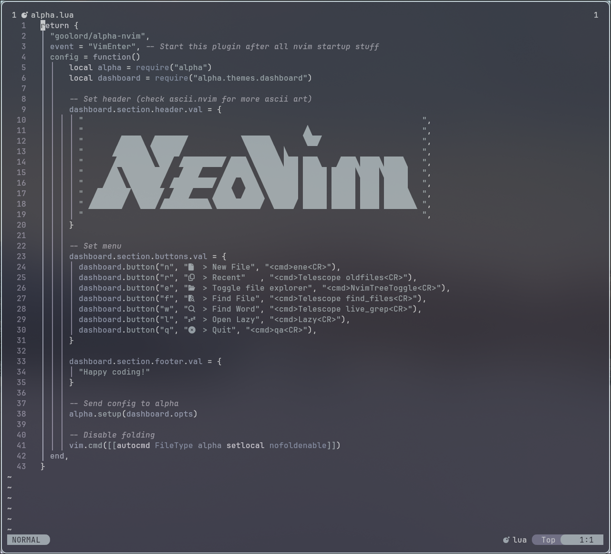
  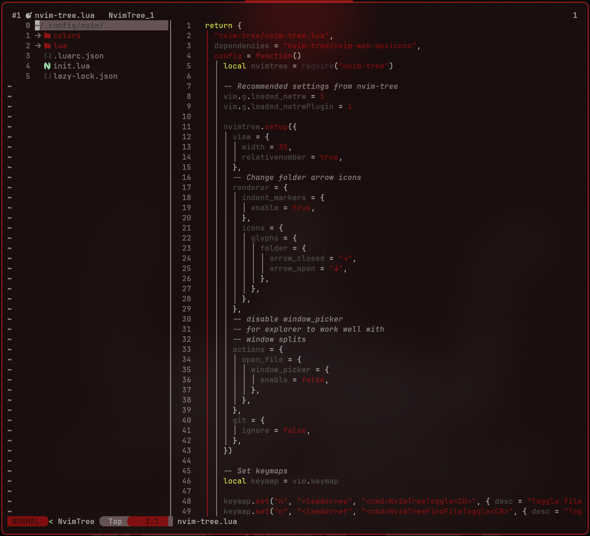
</div>

</details>

<br>

<details id="wlogout">

  <summary>Wlogout</summary>

  ## Overview
  Simple power menu. Shows a row with the different power options.

  **I don't know how to screenshot wlogout :(**

</details>

<br>

<details>
  <summary>Wallpapers</summary>
  
  ## Overview

  Use ``waypaper`` to select the image you want from ``~/wallpapers``. Applies the wallpaper using `swww` and the `change.sh` script in `~/.config/waypaper` folder generates a new Pywal palette and update the system colors.

  <div align="center">
    
  </div>

  > The system is running in an HDD, that's why the recording is a bit laggy

</details>

<br>

<details>
  <summary>Pywalfox</summary>

  ## Overview

  Modifies `Firefox` or `Librefox` so that it  change its colors automatically when `Pywal` updates its color scheme. 

  > [!IMPORTANT]
  > **MAKE SURE TO ALSO INSTALL THE [BROWSER ADDON](https://addons.mozilla.org/en-US/firefox/addon/pywalfox/)**

  <div align="center">
  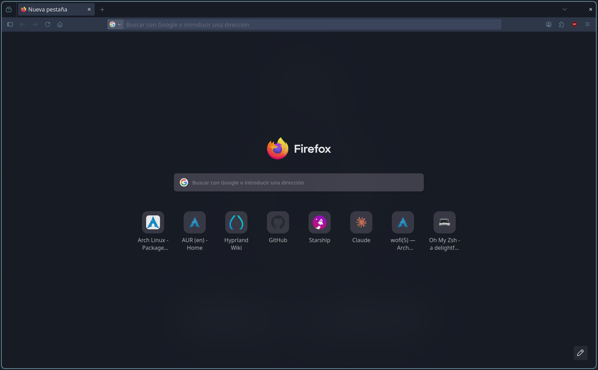
  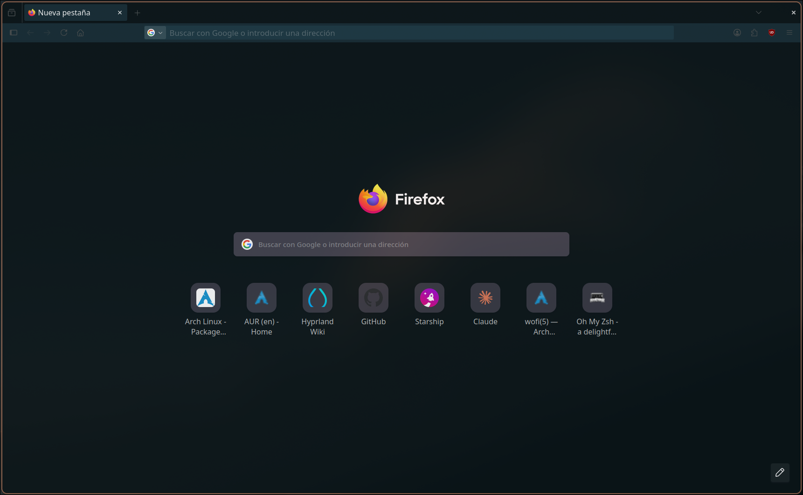
  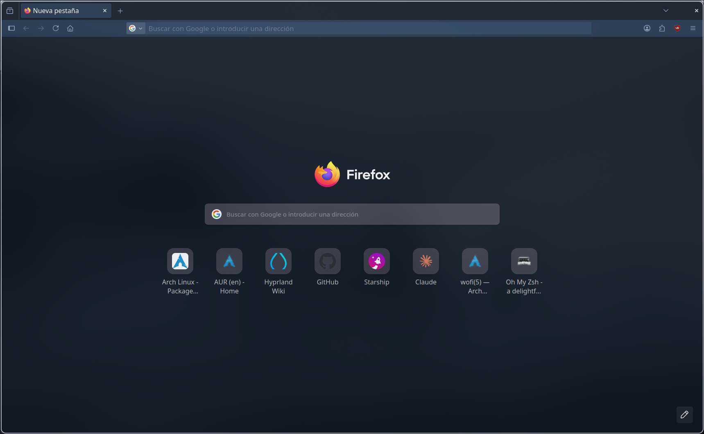
  </div>

</details>

<br>

<details>
  <summary>Starship</summary>

  ## Overview

  Custom terminal prompt. Uses pywal colors.

  <div align="center">
    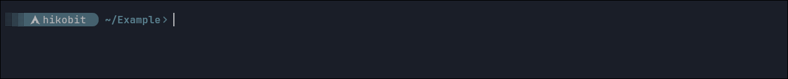
    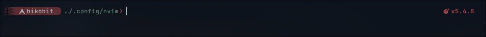
    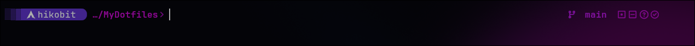
  </div>

</details>

<br>

<details>
  <summary>Fastfetch</summary>

  ## Overview
  
  Display system info and shows the world that you are using Arch BTW!

  <div align="center">
    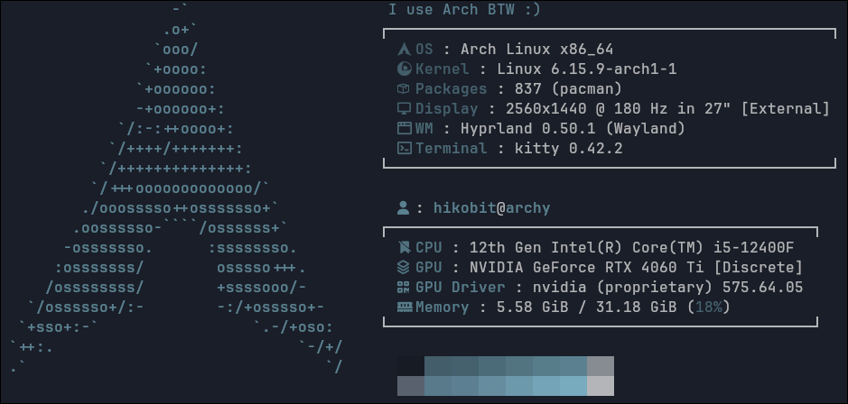
    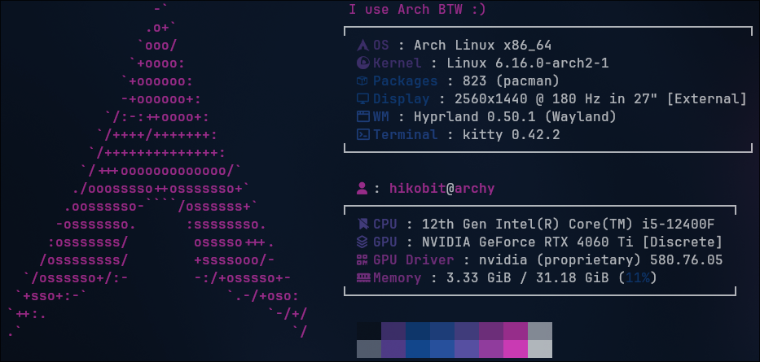
    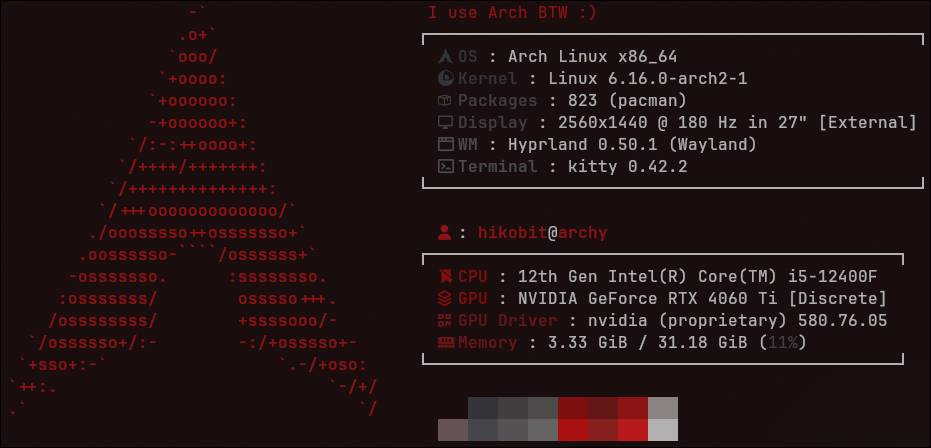
  </div>

</details>

<br>

<details>
  <summary>Sddm</summary>

  ## Overview
  
  Theme from [SilentSDDM](https://github.com/uiriansan/SilentSDDM).

  <div align="center">
    
  </div>

</details>

<br>

<details>
  <summary>Boot animation</summary>

  ## Overview
  
  Custom boot animation [I made myself](https://github.com/MrE8065/PSLinux). Uses `plymouth`.

  https://github.com/user-attachments/assets/cb767248-547b-402e-99c9-042714291f87

</details>

<br>

<details>
  <summary>GTK Themes</summary>

  ## Overview
  
  <div align="center">
  
  |   Theme   |       Name        |
  |-----------|-------------------|
  |   Cursor  |      Bibata       |
  |    Icon   |   Papirus Dark    |
  |   System  |   Materia-Dark    |

  </div>

</details>

<br>

<a id="keybinds"></a>

# ⌨️ Keybinds

`Mod+Q` - Close app

`Mod+R` - Open App Launcher

`Mod+B` - Open browser

`Mod+E` - Open file manager

`Mod+W` - Open wallpaper changer

`Mod+I` - Open emoji menu

`Mod+Shift+S` - Open capture menu

`Mod+K` - Open clipboard history

`Mod+Alt+K` - Clean clipboard history

`Mod+F` - Maximize app

`Mod+Shift+F` - Fullscreen app

`Mod+V` - Toggle floating window

`Mod+L` - Activate lockscreen

`Mod+Shift+R` - Reload waybar and swaync

`Mod+M` - Quit Hyprland

> [!Tip]
> This are just the most used keybinds.
> 
> More can be found and changed in `~/.config/hypr/hyprland.conf`


<br>

<a id="packages"></a>

# 📦 Packages

Check the [packages](./scripts/packages.sh) script to see all the packages that will be installed.
